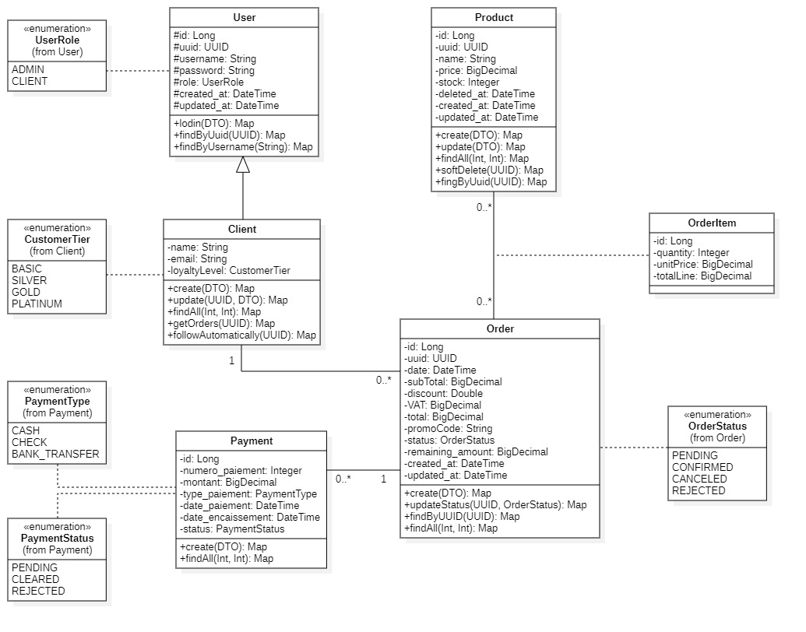

# 🛒 SmartShop - Système de Gestion Commerciale B2B

[](https://www.oracle.com/java/)
[](https://spring.io/projects/spring-boot)
[](https://www.postgresql.org/)
[](https://maven.apache.org/)
[](LICENSE)

## 📋 Table des Matières

- [À Propos](#-à-propos)
- [Fonctionnalités](#-fonctionnalités)
- [Technologies](#-technologies)
- [Architecture](#-architecture)
- [Documentation API](#-documentation-api)
- [Tests](#-tests)
- [Règles Métier](#-règles-métier)

---

## 🎯 À Propos

**SmartShop** est une application web REST API de gestion commerciale B2B développée pour **MicroTech Maroc**, distributeur de matériel informatique basé à Casablanca.

L'application permet de gérer un portefeuille de **650 clients actifs** avec :
- Un système de fidélité automatique à remises progressives
- Des paiements fractionnés multi-moyens par commande
- Une traçabilité complète des événements financiers
- Une gestion optimisée de la trésorerie

### ⚠️ Points Importants

- **Backend uniquement** - Aucune interface graphique
- **Tests via API Tester** - Postman et Swagger UI
- **Authentification HTTP Session** - Pas de JWT, pas de Spring Security
- **Deux rôles** : ADMIN (employés MicroTech) et CLIENT (entreprises clientes)

---

## ✨ Fonctionnalités

### 👥 Gestion des Clients
- ✅ CRUD complet des clients
- ✅ Statistiques automatiques (commandes, montants cumulés)
- ✅ Historique des commandes par client
- ✅ Consultation du profil et niveau de fidélité

### 🏆 Système de Fidélité Automatique
Calcul automatique basé sur l'historique :
- **BASIC** : Par défaut (nouveau client)
- **SILVER** : ≥ 3 commandes OU ≥ 1 000 MAD
- **GOLD** : ≥ 10 commandes OU ≥ 5 000 MAD
- **PLATINUM** : ≥ 20 commandes OU ≥ 15 000 MAD

Remises progressives appliquées sur futures commandes :
- **SILVER** : 5% si sous-total ≥ 500 MAD
- **GOLD** : 10% si sous-total ≥ 800 MAD
- **PLATINUM** : 15% si sous-total ≥ 1 200 MAD

### 📦 Gestion des Produits
- ✅ CRUD complet des produits
- ✅ Gestion du stock automatique
- ✅ Soft delete (produits utilisés dans commandes)
- ✅ Filtres et pagination

### 🛍️ Gestion des Commandes
- ✅ Commandes multi-produits avec quantités
- ✅ Validation automatique du stock
- ✅ Application des remises cumulatives (fidélité + code promo)
- ✅ Calcul automatique : Sous-total, Remises, TVA , Total TTC
- ✅ Gestion des statuts : PENDING, CONFIRMED, CANCELED, REJECTED

### 💰 Système de Paiements Multi-Moyens
Trois moyens acceptés :
- **ESPÈCES** : Limite légale 20 000 MAD (Art. 193 CGI)
- **CHÈQUE** : Avec numéro, banque, échéance
- **VIREMENT** : Avec référence, banque

**Règle importante** : Une commande doit être **totalement payée** (montant_restant = 0) avant validation par ADMIN.

---

## 🛠️ Technologies

### Backend
- **Java 17**
- **Spring Boot 3.2.3**
- **Spring Data JPA** / Hibernate
- **Spring Web** (REST API)
- **PostgreSQL** (JDBC Driver inclus)

### Outils & Libraries
- **Lombok 1.18.30** - Réduction du code boilerplate
- **MapStruct 1.5.5.Final** - Mapping Entity ↔ DTO
- **Jakarta Validation** - Validation des données
- **Springdoc OpenAPI 2.2.0** - Documentation Swagger
- **JUnit 5** & **Mockito** - Tests unitaires
- **JaCoCo 0.8.11** - Couverture de code
- **Spring Security Crypto 6.2.2** - Hachage des mots de passe

### Concepts Java Utilisés
- Stream API
- Lambda Expressions
- Java Time API
- Builder Pattern
- Optional

---

## 🏗️ Architecture

### Structure du Projet

```
com.smartshop.smartshop
├── config/
├── controller/         
├── exception/        
├── model/
│   ├── entity/          
│   ├── dto/             
│   ├── enums/           
│   └── mapper/        
├── repository/  
└── service/
    ├── interfaces/      
    └── impl/                  
```

### Couches Applicatives

```
┌─────────────────┐
│   Controller    │  ← Endpoints REST (JSON)
├─────────────────┤
│   Service       │  ← Logique métier
├─────────────────┤
│   Repository    │  ← Accès données (JPA)
├─────────────────┤
│   Database      │  ← PostgreSQL/MySQL
└─────────────────┘
```

## 📚 Documentation API

### Swagger UI

Une fois l'application lancée, accédez à :

🔗 **http://localhost:8080/swagger-ui.html**

### Collection Postman

Importez la collection fournie dans le dossier `/postman` pour tester tous les endpoints.

### Endpoints Principaux

| Méthode | Endpoint | Description | Rôle |
|---------|----------|-------------|------|
| **Auth** ||||
| POST | `/auth/login` | Connexion | Tous |
| POST | `/auth/logout` | Déconnexion | Tous |
| **Clients** ||||
| POST | `/clients` | Créer un client | ADMIN |
| GET | `/clients` | Liste des clients | ADMIN |
| GET | `/clients/profile/{uuid}` | Profil d'un client | ADMIN/CLIENT |
| PUT | `/clients/{uuid}` | Modifier un client | ADMIN |
| DELETE | `/clients/{uuid}` | Supprimer un client | ADMIN |
| GET | `/clients/orders` | Mes commandes | CLIENT |
| GET | `/clients/orders/statistics` | Mes statistiques | CLIENT |
| **Produits** ||||
| POST | `/products` | Créer un produit | ADMIN |
| GET | `/products` | Liste des produits | Tous |
| GET | `/products/{uuid}` | Détails d'un produit | Tous |
| PUT | `/products/{uuid}` | Modifier un produit | ADMIN |
| DELETE | `/products/{uuid}` | Supprimer (soft) | ADMIN |
| PUT | `/products/{uuid}/restore` | Restaurer un produit | ADMIN |
| GET | `/products/deleted` | Produits supprimés | ADMIN |
| **Commandes** ||||
| POST | `/orders` | Créer une commande | ADMIN |
| GET | `/orders` | Liste des commandes | ADMIN |
| GET | `/orders/{uuid}` | Détails d'une commande | ADMIN |
| PUT | `/orders/{uuid}/{status}` | Changer le statut | ADMIN |
| GET | `/orders/{uuid}/payments` | Paiements d'une commande | ADMIN |
| **Paiements** ||||
| POST | `/payments` | Enregistrer un paiement | ADMIN |
| GET | `/payments` | Liste des paiements | ADMIN |

---

## 🧪 Tests

### Lancer les Tests Unitaires

```bash
mvn test
```

### Lancer les Tests avec Couverture

```bash
mvn test jacoco:report
```

Le rapport de couverture sera disponible dans : `target/site/jacoco/index.html`

### Structure des Tests

```
src/test/java/com/smartshop/smartshop
└── service/impl/
    ├── ClientServiceTest
    ├── OrderServiceTest
    ├── PaymentServiceTest
    ├── ProductServiceTest
    └── UserServiceImplTest
```

---

## 📐 Règles Métier

### Système de Fidélité

**Acquisition du niveau** (basé sur historique total) :
```
BASIC    → Niveau par défaut
SILVER   → ≥ 3 commandes OU ≥ 1 000 MAD cumulé
GOLD     → ≥ 10 commandes OU ≥ 5 000 MAD cumulé
PLATINUM → ≥ 20 commandes OU ≥ 15 000 MAD cumulé
```

**Utilisation du niveau** (remises sur futures commandes) :
```
SILVER   → 5% si sous-total ≥ 500 MAD
GOLD     → 10% si sous-total ≥ 800 MAD
PLATINUM → 15% si sous-total ≥ 1 200 MAD
```

### Calcul d'une Commande

```
1. Sous-total HT = Σ(prix_unitaire × quantité)
2. Montant remise = Sous-total × (% fidélité + % promo)
3. Montant HT après remise = Sous-total HT - Montant remise
4. TVA = La somme des TVA de chaque produit du commande
5. Total TTC = Montant HT après remise + TVA
```

**Exemple :**
```
Sous-total : 1 000 MAD
Remise 10% (GOLD) : -100 MAD
Montant HT : 900 MAD
TVA : 180 MAD
Total TTC : 1 080 MAD
```

### Transitions de Statut

**Commande** :
```
[Création] → PENDING
    ↓ (ADMIN + paiement complet)
    └─→ CONFIRMED
    
    [Création] → PENDING
    ↓ (ADMIN)
    └─→ CANCELED
    
    [Création] → PENDING
    ↓ (stock insuffisant)
    └─→ REJECTED (automatique)
```

**Paiement** :
```
[Création] → PENDING
    ↓
    ├─→ COMPLETED (encaissé)
    └─→ REJECTED (rejeté)
```

### Validations Critiques

✅ **Stock** : quantité_demandée ≤ stock_disponible  
✅ **Paiement espèces** : montant ≤ 20 000 MAD (Art. 193 CGI)  
✅ **Code promo** : format `PROMO-XXXX` (4 caractères alphanumériques)  
✅ **Confirmation commande** : montant_restant = 0  
✅ **Arrondis** : tous les montants à 2 décimales

---

## 🔐 Permissions

### Matrice des Rôles

| Fonctionnalité             | CLIENT | ADMIN |
|----------------------------|--------|-------|
| **Authentification**       |||
| Login/Logout               | ✅ | ✅ |
| **Clients**                |||
| Créer un client            | ❌ | ✅ |
| Voir tous les clients      | ❌ | ✅ |
| Voir profil                | ✅ | ✅ |
| Modifier un client         | ❌ | ✅ |
| **Produits**               |||
| Voir les produits          | ✅ (lecture) | ✅ |
| Créer/Modifier/soft delete | ❌ | ✅ |
| **Commandes**              |||
| Créer une commande         | ❌ | ✅ |
| Voir toutes les commandes  | ❌ | ✅ |
| Voir ses commandes         | ✅ | N/A |
| Changer le statut          | ❌ | ✅ |
| **Paiements**              |||
| Enregistrer un paiement    | ❌ | ✅ |
| Voir tous les paiements    | ❌ | ✅ |

---

## 📊 Modèle de Données

### Diagramme UML


